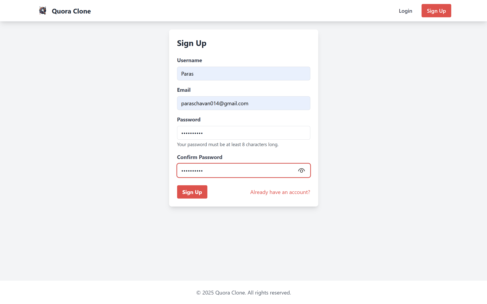
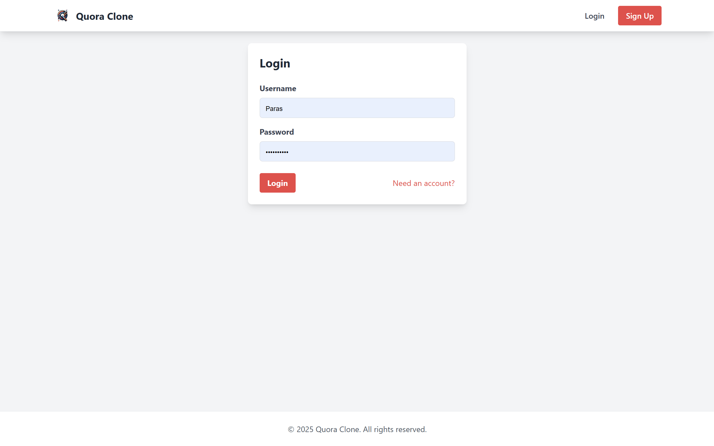
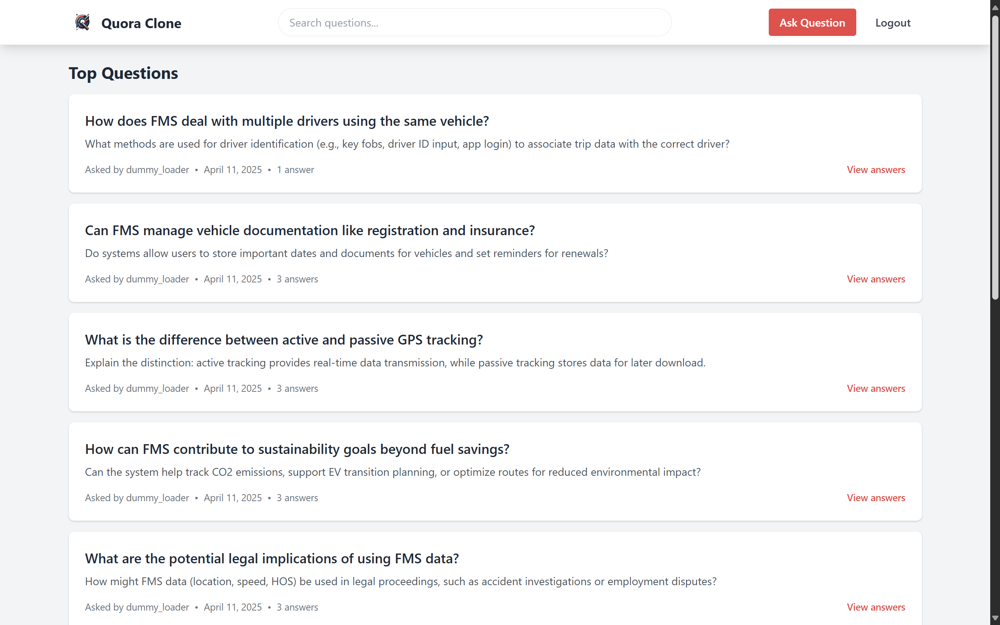
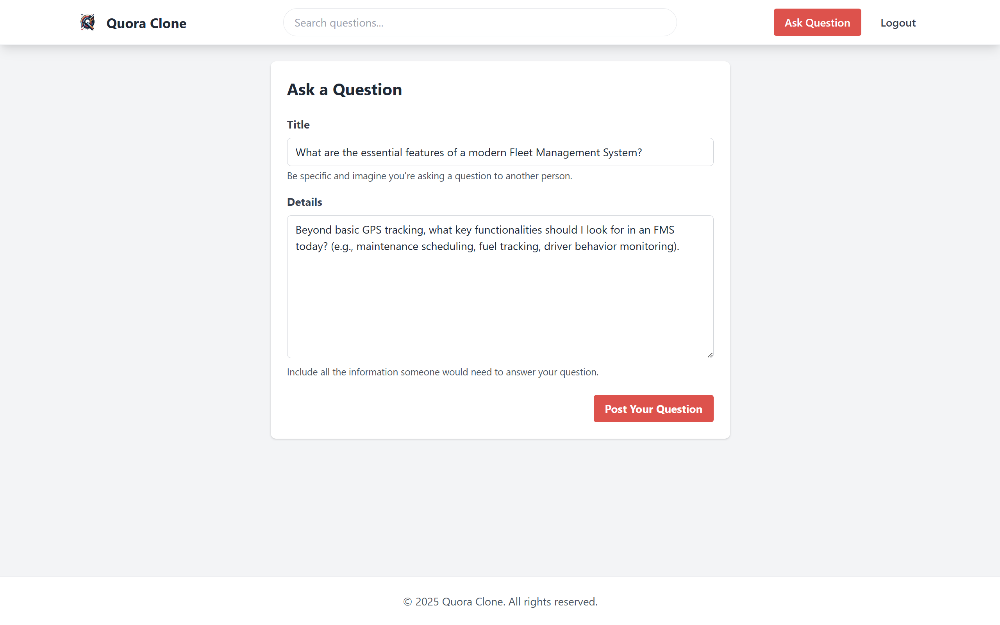
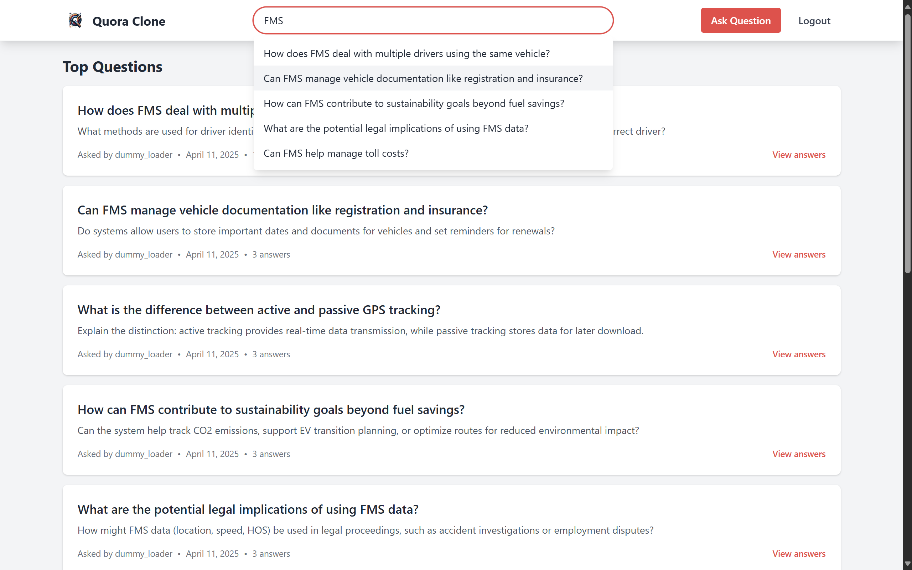

## Setup and Running the Project (Docker)

These instructions guide you through setting up and running the Quora clone application using Docker and Docker Compose for a production-like environment.

**Prerequisites:**

* **Docker:** Make sure Docker is installed on your system. [Install Docker](https://docs.docker.com/engine/install/)
* **Docker Compose:** Make sure Docker Compose (usually included with Docker Desktop) is installed. [Install Docker Compose](https://docs.docker.com/compose/install/)
* **`qna.json` file:** Ensure you have the `qna.json` file (containing the questions and answers data in the specified format) placed in the **root directory** of this project.

**Steps:**

1. **Environment Variables:**

   * Create a file named `.env` in the project root directory.
   * Copy the following content into the `.env` file. You can keep these defaults for testing, but the `SECRET_KEY` should ideally be changed for a real deployment.

   ```dotenv

   # Django settings

   DJANGO_SETTINGS_MODULE=core.config.settings

   DEBUG=False

   SECRET_KEY=your_strong_django_secret_key_here # CHANGE THIS!

   ALLOWED_HOSTS=localhost,127.0.0.1 # Add other hosts if needed

   DJANGO_PORT=8000

   IS_IN_PRODUCTION=1 # Set to 1 for production setup


   # Database settings (using Docker service name 'db')

   DB_NAME=quora_clone_db

   DB_USER=postgres

   DB_PASSWORD=postgres

   DB_HOST=db

   DB_PORT=5432

   ```
2. **Build and Run Docker Containers:**

   * Open your terminal in the project root directory (where `docker-compose.yml` is located).
   * Run the following command:

   ```bash

   docker compose up -d --build

   ```

   * This command will:

     * Build the Docker image for the `web` service using the `Dockerfile` if it doesn't exist or has changed.
     * Pull the PostgreSQL image for the `db` service.
     * Create and start the containers for both services in detached mode (`-d`).
3.  **Load Initial Data:**

    *   Wait for the containers to be up and running (especially the database).
    *   Execute the management command inside the running `web` container to load the questions and answers from your `qna.json` file.

    ```bash
    docker exec -it quora-clone-web-1 python manage.py load_qna qna.json
    ```

    *   *(Note: The container name `quora-clone-web-1` might differ slightly on your system. Use `docker ps` to find the correct name of the running web container if needed.)*
    *   This command uses the `dummy_loader` user to populate the database.
4.  **Run Tests (Optional):**

    *   To ensure everything is set up correctly and the application logic works as expected, you can run the automated tests inside the container:

    ```bash
    docker exec -it quora-clone-web-1 python manage.py test
    ```

    *   This command will execute the test suite defined in the `test/` directory.
5. **Access the Application:**

   * Open your web browser and navigate to:

   ```

   http://localhost:8000

   ```

   * (Or `http://127.0.0.1:8000`)

**Assignment Functionality Screenshots:**

* **1. User Creation (Signup):** Fulfills the requirement: "The user should be able to create a login".

  

  *Description: The signup page allows new users to register.*
* **2. User Login:** Fulfills the requirement: "The user should be able to create a login".

  

  *Description: Registered users can log in to access the application's features.*
* **3. View Questions (List):** Fulfills the requirement: "View questions posted by others".

  

  *Description: The main page displays a list of questions available on the platform.*
* **4. View Question (Detail), Post/View Answers, Like Answers:** Fulfills requirements: "View questions posted by others", "Able to answer questions posted by others", and "Should be able to like answers posted by others".

  

  *Description: Clicking a question title navigates to the detail view, showing the full question content and answers. Logged-in users can post new answers and like existing ones.*
* **5. Post Questions:** Fulfills the requirement: "Post questions".

  

  *Description: Logged-in users can navigate to this form to submit new questions to the platform.*
* **6. Search Questions (Bonus):** Although not explicitly required by the assignment, search functionality is implemented.

  

  *Description: Users can search for questions using the search bar in the header.*
* **7. Logout:** Fulfills the requirement: "Able to log out".

  *(No screenshot)*

  *Description: Logged-in users will see a "Logout" button or link which, when clicked, logs them out and redirects them.*

## URL Mapping

Here are the main URL patterns and their corresponding actions:

* `/` : **Question List** (View all questions)
* `/question/<int:pk>/` : **Question Detail** (View a specific question and its answers, add a new answer)
* `/ask/` : **Ask Question** (Form to create a new question)
* `/search/` : **Search Results Page** (Displays results from a full-page search)
* `/api/search/` : **AJAX Search Endpoint** (Used for the live search dropdown in the header)
* `/answer/<int:answer_id>/like/` : **Like Answer** (Action to toggle like status on an answer)
* `/login/` : **Login Page**
* `/logout/` : **Logout Action**
* `/signup/` : **Signup Page**
* `/admin/` : **Django Admin Interface** (Requires creating a superuser via `docker exec -it quora-web-1 python manage.py createsuperuser`)
